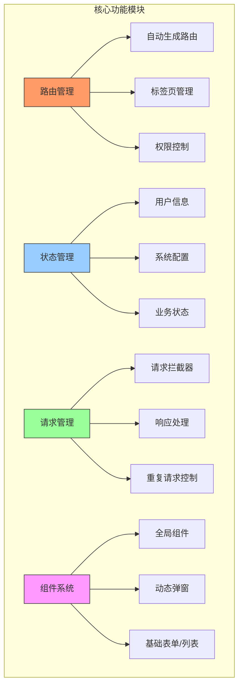

# 介绍

该项目为一个基于 `Vue2` + `TypeScript` 的多应用模板模板项目。包含多个基础项目的模板。




- 后台管理系统：[src](./README.md)
- 移动端：[src/entry/h5](./src/entry/h5/README.md)
- 浙里办：[src/entry/zlb-h5](./src/entry/zlb-h5/README.md)
- 门户网站：[src/entry/library](./src/entry/library/README.md)
- 大屏：[src/entry/bigscreen](./src/entry/bigScreen/README.md)


## 功能介绍

- 支持多项目模板
- 配置支持动态更新
- 动态生成项目
- 动态拉取第三方项目模板

## 技术栈&工具

- Vue2、TypeScript、Vuex、Element、Nodejs、Nunjucks、inquirer
- node：版本推荐 `14.19.1`

### cursor
- 一款集成了人工智能技术的代码编辑器。
- 地址：[https://www.cursor.com/](https://www.cursor.com/)

#### 插件
插件的位置在【左侧边栏】，有个形式俄罗斯方块的标签页。

- Chinese (Simplified) (简体中文)：适用于 VS Code 的中文（简体）语言包。
- ESLint：代码规范检测。
- Prettier：代码格式化。
- Prettier ESLint：确保 ESLint 和 Prettier 的规则不会相互冲突。
- Vue Official：vue语法高亮和格式化。
- Markdown Preview Mermaid Support：markdown支持预览图表。

### apifox（可选）
- API 管理平台，提供接口文档、接口调试、接口Mock、接口自动化测试等功能。支持软件和web版。
- 地址：[https://apifox.com/compare/postman-vs-apifox/?utm_source=baidu&utm_medium=sem&utm_campaign=352505605&utm_content=8777274736&utm_term=%E8%87%AA%E5%8A%A8%E5%AE%9A%E5%90%91&bd_vid=8236617204237704428](https://apifox.com/compare/postman-vs-apifox/?utm_source=baidu&utm_medium=sem&utm_campaign=352505605&utm_content=8777274736&utm_term=%E8%87%AA%E5%8A%A8%E5%AE%9A%E5%90%91&bd_vid=8236617204237704428)


## 基于cursor的开发
如果需要调整代码输出目录，只需改动文档最后的Output中内容即可。注意，修改完后清空上下文，然后重新选择规范文档。
- [PC后台管理代码生成规范](./README_CODING_PC.md)
- [h5移动端代码生成规范](./README_CODING_H5.md)

### PC端
#### PC管理端开发-启动项目
1、打开项目：项目模板在cursor中打开。

2、安装依赖：点击执行NPM脚本中的`start`命令。

3、启动项目：点击执行NPM脚本中的`dev`命令，成功后会出现项目访问地址，打开浏览器点击登录后可进入后台管理系统。

#### PC管理端开发-输出PRD
1、整理需要：只需要有大概的内容即可，比如考试平台的后台需要题库管理、试卷管理等功能。

2、分步优化：`Ctrl+I`进入composer聊天框，确保上下文选中`README_CODING_PC.md`。输入比如“需求内容：xxxx。请帮我生成题库管理功能的prd”。

3、内容微调：将完善的PRD内容保存在`prd.md`文件中，然后进行字段或者交互上的微调。

#### PC管理端开发-实现前端界面
1、功能实现：`Ctrl+I`进入comoser聊天框，上下文选中`README_CODING_PC.md`，将prd文档中的一个功能点文档复制上去，提交即可。等代码生成完成后点击聊天框右下角的`Accept all`即可。如果内容过长没有全部生成，可以输入“继续”来二次生成，最后同样点击`Accept all`即可。可以在浏览器直接查看效果。

2、菜单生成：有时候左侧菜单不一定生成，此时在聊天框继续对话比如输入“请将文章管理添加到菜单中”。然后在浏览器中查看效果。

3、错误处理：控制台遇到报错可直接复制错误信息，粘帖到对话框输入“修复”即可。

4、功能优化：针对界面中不符合要求的地方，继续提出改进意见，可以优先点击`Save all`查看效果，如果满意则点击`Accept all`。

### 移动端
#### H5移动端开发-启动项目
1、启动项目：点击执行NPM脚本中的`dev:h5-demo`命令，成功后会出现项目访问地址。

2、访问页面：点击业务中的对应页面进行跳转。

#### H5移动端开发-输出PRD
1、整理需要：只需要有大概的内容即可，比如考试平台的移动端需要实名认证、试卷列表、在线考试等功能。

2、分步优化：`Ctrl+I`进入聊天框。输入比如“帮我实现移动端在线考试功能的prd”。

3、内容整合：将所有的功能prd保存在`src/prd_h5.md`中。

#### H5移动端开发-实现前端界面
1、功能实现：打开`README_CODING_H5.md`代码生成规范、然后`Ctrl+I`进入聊天框，将PRD文档中的一个功能点文档复制上去，提交即可。等代码生成完成后点击聊天框右下角的`Accept all`即可。如果内容过长没有全部生成，可以输入“继续”来二次生成，最后同样点击`Accept all`即可。

2、功能优化：针对界面中不符合要求的地方，继续提出改进意见，可以优先点击`Save all`查看效果，如果满意则点击`Accept all`。

3、界面优化：可以找一个类似场景的设计稿来进行界面的美化，比如输入“请参考这个设计优化xxx处”。


### 其他
#### 生成openapi格式的接口文档
> 接口文档`openapi.json`可以使用`apifox`工具导入，然后生成对应的接口文档。方便快速进行接口评审。

方式一：上下文选中`openapi.json`文件和需求文档`prd.md`文件，`Ctrl+I`进入聊天框，输入“请基于需求文档，帮我生成openapi格式的接口文档，写到openapi.json中”。

方式二：上下文选中`openapi.json`文件，Ctrl+I进入聊天框，输入“请基于src/views/user-manage/api.ts文件，帮我生成openapi格式的接口文档，写到openapi.json中”。


## 安装使用步骤

### clone

```bash
# 下载代码前设置下git（系统设置提交时转换为LF，检出时不转换 ）
git config --global core.autocrlf input
# 下载代码
git clone git@gitlab.icinfo.co:fed/base-vue-template.git
```

### install

```bash
npm run start
```

### run

```bash
# 执行最外层（src）下的管理系统运行
npm run dev

# 执行最外层（src）下的移动端h5运行
npm run dev:h5-demo

# 如果想要运行 entry 下的子项目，需要自行在 package.json 中增加脚本
# cross-env VUE_APP_ENTRY=${entryDirName} vue-cli-service serve --open --mode=development
```

### build

```bash
# 执行最外层的
npm run build

# 如果想要运行 entry 下的子项目，需要自行在 package.json 中增加脚本
# cross-env VUE_APP_ENTRY=${entryDirName} vue-cli-service build --mode=production
```

### 其他脚本介绍
- `npm run reset`：git 还原代码到上个版本
- `npm run save`：git 保存代码到本地
- `npm run base:init`

    - 初始化整个项目，去掉 `src/entry` 下的所有子项目，并且删除 `package.json` 中多余的脚本，将项目变为一个单纯的 `后台管理系统` 不带任何子项目。（注意：通过蜻蜓云效新建项目的时候，如果模板选择的是 `纯净模板` 则会默认执行 `base:init` 脚本）

- `npm run update:core`

    - 更新 `core` 文件夹的内容，首先会从 `http://gitlab.icinfo.co/fed/base-vue-template` 拉取 `master` 分支的 `core` 文件夹到 `.tmp` 临时文件夹中，然后对比 `core/config.json` 中的 `version` 和本地是否有差异。如果有差异，则会自动将拉取的 `core` 文件夹覆盖本地的 `core` 文件夹，并且会对比 `package.json` 文件是否有更新，如果有新增 `包/脚本`，会自动加入并且执行 `install`。
    - `强制更新`：如果想要不对比版本直接覆盖整个 `core` 文件夹，可以执行：`npm run update:core force`

- `npm run get:entry`

    - 用于获取子项目，子项目对应的内容存放位置
        - 后台管理系统：src/entry/admin
        - 移动端 h5：src/entry/h5
        - 浙里办 h5：src/entry/zlb-h5
        - 大屏：src/entry/bigscreen
        - 门户：src/entry/library
    - 依照提示选择对应的类型，并且输入子项目名称即可
        - `是否为定制项目`：关于该选项是用于处理项目是否要作为子项目独立存在还是作为外部项目的一个扩展（用外部项目的路由/store 等）

- `npm run load`

    - 用于获取远程的指定文件内容
        - npm run load <sourceUrl> [targetUrl]
    - examples：把远程的 src/components 拉取到 src/abc/
        - npm run load src/components src/abc
            - 如果不带 `http` 链接默认会从本仓库目录下查找
    - examples：从别的参考获取内容。将 `icinfo-ui` 的 `master` 分支 的 `lib` 文件夹 拉取到我本地项目的 `test` 目录
        - npm run load http://gitlab.icinfo.co/fed/icinfo-ui/-/tree/master/lib test

- `npm run gen:report <fileName> <title> [insertToViews]`

    - 说明：用于快速生成一个 `表格列表页面`（包含页面和 router）
    - 参数说明
        - `fileName`：用于生成的文件夹的名称（router 的名称也会用该名称），如果名称中包含 `-` 则组件名称会自动去掉并且将首字母转换为大写（test-page => TestPage）
        - `title`：用于生成 `router` 的 `title`
        - `insertToViews`：是否将文件生成到 `src/views` 目录下。如果设置为 `false` 则会将文件生成在当前执行的目录下
    - examples：`npm run gen:report test-report 测试报表`

    

- `npm run gen:form <fileName> <title> [insertToViews]`

    - 说明：用于快速生成一个 `表单页面`（包含页面和 router）
    - 使用方式参考：`gen:report`

- `npm run gen:detail <fileName> <title> [insertToViews]`

    - 说明：用于快速生成一个 `详情页面`（包含页面和 router）
    - 使用方式参考：`gen:report`

## 目录

```bash
├── .vscode                # VSCode 配置
├── core                   # 核心功能模块
├── docs                   # 文档
├── node_modules           # npm 依赖包
├── plop-templates         # Plop.js 模板
├── src                    # 源代码
    ├── views              # 页面
        ├── user-manage    # 用户管理
            ├── index.vue  # 用户管理页面
            ├── router.js  # 用户管理路由
            ├── api.ts      # 用户管理接口
            ├── enum.ts     # 用户管理枚举
            ├── components  # 用户管理组件
├── tests                  # 测试文件
├── .editorconfig          # 编辑器配置
├── .env                   # 环境变量
├── .env.development       # 开发环境变量
├── .env.fat               # FAT 环境变量
├── .env.production        # 生产环境变量
├── .env.uat               # UAT 环境变量
├── .eslintignore          # ESLint 忽略文件
├── .eslintrc.js           # ESLint 配置
├── .gitignore             # Git 忽略文件
├── .prettierignore        # Prettier 忽略文件
├── .prettierrc.js         # Prettier 配置
├── .stylelintignore       # Stylelint 忽略文件
├── .stylelintrc.js        # Stylelint 配置
├── .travis.yml            # Travis CI 配置
├── .vcmrc                 # VCM 配置
├── api-generator.js       # API 生成器
├── api.rest               # API 规范
├── babel.config.js        # Babel 配置
├── jsconfig.json          # JavaScript 配置
├── package-lock.json      # npm 锁定文件
└── package.json           # npm 配置文件
```

## core 目录

```bash
core
├── build                          # 构建相关内容
│   ├── alias.js                   # 别名都存储在这，会动态将 src/entry 目录下的所有文件都增加一个别名，规则：@文件名称、
│   ├── ........
├── common                         # 公共模块
│   ├── configurations             # 配置文件
│   │   ├── initConfig             # 初始化一些配置（其实就是把 main.ts 相同的部分内容抽离出来了，包含各个类型文件的初始化配置）
│   │   ├── VueConfig              # vue.config.js 的公共配置抽离
│   ├── hooks                      # 一些自定义的钩子函数
│   ├── http                       # 公共的 HTTP 请求处理
│   ├── public                     # 公共资源
│   ├── router                     # 公共的路由管理
│   ├── store                      # 公共的状态管理
│   └── template                   # 公共的模板管理（index.html）
├── developmentTools               # 该文件夹用于开发生成个类型代码
│   ├── generatePage               # 页面生成（用于生成 report、form、detail）
│   │   ├── common.js              # 公共功能（用于加载模板，生成对应的代码，处理文件名称之类的）
│   │   └── report.js              # 表格页面生成
│   │   └── form.js                # 表单页面生成
│   │   └── detail.js              # 详情页面生成
│   ├── getTemplate                # 根据脚本获取对应的模板（gen:entry 脚本相关内容)
│   │   └── index.js               # 入口文件（gen:entry 脚本执行的入口文件）
│   │   └── ........
│   ├── init                       # 初始化项目模板（base:init 脚本相关内容）
│   │   └── index.js               # 入口文件（base:init 执行的入口文件）
│   ├── loadFileToBaseTemplate     # 加载文件到模板项目（load 脚本相关内容）
│   │   └── index.js               # 入口文件（load 脚本执行的入口文件）
│   └── updateCore                 # 更新 core 模块相关内容（update:core 脚本）
│   │   └── index.js               # 入口文件（update:core 脚本执行的入口文件）
│   │   └── ........
├── share                          # 共享模块
│   └── log                        # 日志管理
├── utils                          # 工具函数
│   ├── file.js                    # 文件处理
│   ├── gitHelpers.js              # Git 辅助功能
│   ├── path.js                    # 路径处理
│   ├── platform.js                # 平台相关功能
│   ├── run.js                     # 运行相关功能
│   ├── validate.js                # 验证功能
│   └── write.js                   # 文件写入相关功能
├── config.json                    # 配置文件
└── README.md                      # 项目说明文档，包含更新内容
```

## 使用

该项目一般不会单独使用，可通过蜻蜓云效新建仓库的时候选择 `多项目基础模板-纯净版`


## 环境配置
### 反向代理
**反向代理规则**：`VUE_APP_BASEURL_API`和`DEV_PROXY_TARGET_API`配对。如果要新增多个代理，可以按照上述变量新增，并在`_API`后缀添加相同变量，然后重启服务即可，比如：
```bash
# 代理地址2
VUE_APP_BASEURL_API_ADMIN='/@API_ADMIN'
DEV_PROXY_TARGET_API_ADMIN='http://192.168.1.155:8885/api'
```

## 全局配置
全局配置位于`src/config/index.ts`文件中，用于管理不同环境下的配置项。

### 配置结构
```typescript
const defaultConfig = {
    // 浙政钉配置
    ZZD_CONFIG: {
        /** 浙政钉扫码登录地址 */
        loginUrl: 'xxx',
        /** 登录域名 */
        loginDomain: 'xxx',
    },
    // 其他配置项...
}
```

### 环境区分
配置文件根据`VUE_APP_ENV`环境变量区分不同环境：
- `dev`: 本地开发环境
- `uat`: 测试环境
- `fat`: 开发环境
- 默认: 生产环境

### 使用方式
```typescript
import config from '@/config'

// 获取浙政钉配置
const { ZZD_CONFIG } = config
console.log(ZZD_CONFIG.loginUrl)

// 在组件中使用
@Component
export default class MyComponent extends Vue {
    mounted() {
        const { ZZD_CONFIG } = config
        // 使用配置...
    }
}
```

### 添加新配置
1. 在`defaultConfig`中添加默认配置（生产环境）
2. 在对应环境判断中覆盖配置
```typescript
if (VUE_APP_ENV === 'dev') {
    Object.assign(defaultConfig, {
        // 开发环境特定配置
        NEW_CONFIG: {
            key: 'value'
        }
    })
}
```

### 本地开发

- 基于`.env.development` 复制一份`.env.development.local`
- 在`.env.development.local`进行修改。接口前缀`VUE_APP_BASEURL_API`固定配置为`/@API`，接口代理`DEV_PROXY_TARGET_API`配置为联调地址，比如`http://127.0.0.1:8888/api`
- 接口函数自动生成：修改`api-generator.js`中`apis`（文档地址+/api.json），再执行`npm run api`

### 测试环境

- 配置文件为`.env.uat`
- 如果走 nginx 反向代理，则配置`VUE_APP_BASEURL_API`为`/@API`，否则配置`VUE_APP_BASEURL_API`为测试地址。

### 生产环境

- 配置文件为`.env.production`
- 如果走 nginx 反向代理，则配置`VUE_APP_BASEURL_API`为`/@API`，否则配置`VUE_APP_BASEURL_API`为生产地址。


## 请求管理

请求管理位于`src/scripts/http`目录下，包含`http.ts`文件。可以配置多个不同源的请求，比如`httpPDFURL`、`httpDoc`等。

### 核心配置

- `exHooks`：请求拦截器，可以配置多个拦截器，拦截器名称对应`core/common/http/hooks`目录下的文件名称。
- `baseURL`：请求基础 URL，如果配置了该值，则会使用该值作为基础 URL，否则使用`VUE_APP_BASEURL_API`作为基础 URL。
- `isResponseSuccess`：是否为成功响应，默认值为`(res) => res.code == undefined || res.code === 0 || res.code === 200`。
- `getResponseSuccess`：获取成功响应内容，默认值为`(res) => res`。
- `getResponseError`：获取错误响应内容，默认值为`(res) => ({ message: res.message || '网络走神了', code: res.code || '-1' })`。
- `notDeduplicate`：是否不允许重复请求（针对于单独请求），默认值为`false`。
- `useDeduplicate`：是否开启不允许重复请求功能，默认值为`false`。
- `deduplicateFilter`：重复请求过滤配置，默认值为`() => false`。

### 使用案例

- 一般接口函数位于`src/services`目录下。由`api-generator.js`自动生成。

```typescript
/**
 * @file API：default
 */

import { ExAxiosRequestConfig } from 'icinfo-request'
import { http } from '@/scripts/http'

/**
 * 登录
 * @param data 要提交给服务器的数据
 * @param options 附加选项
 * @author liuyongfei
 */
export function login(
    data?: {
        /** 用户名 */ username: string
        /** 密码 */ password: string
        /** 登录类型 */ loginType: string
    },
    options?: ExAxiosRequestConfig,
) {
    return http.request<Result<UserInfoVo>>({
        url: '/login',
        type: 'POST',
        data,
        ...options,
    })
}

export interface ErrorInfo {
    /**
     * 错误属性
     */
    field: string

    /**
     * 错误信息
     */
    info: string
}

export interface Result<T> {
    /**
     * 返回编码.200=成功
     */
    code: number

    /**
     * 返回信息
     */
    message: string

    /**
     * 返回数据
     */
    data: T

    /**
     * 错误信息
     */
    errors: ErrorInfo[]
}

export interface UserInfoVo {
    /**
     * 真实姓名
     */
    realName: string

    /**
     * 登录类型
     */
    loginType: string

    /**
     * 用户名
     */
    username: string

    /**
     * token
     */
    token: string
}
```
- vue组件中直接使用全局方法`$http`
```html
<script lang="ts">
import { Component, Prop, Vue } from 'vue-property-decorator'
@Component
export default class ComponentName extends Vue {
  mounted() {
     this.$http.post('/api/user/list',{sex:1})
  }
}
</script>
```

## 路由

路由由系统自动生成，无需手动配置。满足以下条件即可：

- 在`src/views`目录下新建业务文件夹
- 包含路由文件`router.js`
- 包含页面文件`index.vue`

### 路由属性

- `name`：路由名称，用于在`router`中使用
- `meta`：路由元信息，用于在`router`中使用
    - `bodyClass`：设置`body`标签的`class`
    - `parent`：父级路由名称，默认值为`Index`，不需要修改。
    - `title`：路由标题，用于设置当前路由的标题
    - `keepAlive`：是否缓存页面，用于设置当前路由是否缓存页面
    - `requireAuth`：是否需要登录，用于设置当前路由是否需要登录。默认`true`
    - `activeMenu`：当前激活菜单，用于设置当前路由激活的菜单。比如进入`文章新增`页面时应该将`文章管理`设置为激活菜单。
    - `noCache`：当前路由组件强制不缓存。默认`false`。一般新增编辑页面设置为`true`。
    - `affix`：是否固定在标签页中。默认`0`不固定，数字越大越靠前。

## 状态管理

状态管理位于`src/store`目录下，包含`modules`和`useStore.ts`文件。

- `modules/user.ts`为登录用户信息管理
- `modules/settings.ts`为系统配置管理
- `modules/tagsView.ts`为标签页管理
- `modules/app.ts`为系统业务配置管理

### 使用案例

#### 配置

- `Mutation`函数名称推荐使用小驼峰式`setXyz`
- `Action`函数名称推荐以`sync`开头，比如`syncSomething`
- 项目业务相关的本地存储推荐在`app`模块中配置，属性名称推荐以`$`开头，比如`$dontShowDeleteConfirm`

```typescript
@Module({
    name: 'app',
    namespaced: true,
    stateFactory: true,
})
export default class AppModule extends BaseAppStore {
    /**
     *  是否不显示移动出卷宗目录的确认框
     * */
    public $dontShowDeleteConfirm = false
    /**
     *  设置是否不显示移动出卷宗目录的确认框
     * */
    @Mutation
    public setDontShowDeleteConfirm(value: boolean) {
        this.$dontShowDeleteConfirm = value
    }
    @Action
    public syncSomething() {
        // 异步处理某些内容
        return new Promise(resolve => {
            this.setDontShowDeleteConfirm(false)
            resolve('')
        })
    }
}
```

#### 使用

```typescript
import { Component, Vue, Prop, Watch, Ref } from 'vue-property-decorator'
import { userStore, appStore } from '@/store/useStore'

@Component({
    name: 'Step2',
    components: {},
})
export default class Step2 extends Vue {
    async login() {
        userStore.setPermissionMenus([])
        userStore.login('token123')
        userStore.setUserInfo({
            name: '张三',
            username: 'zhangsan',
            sex: 1,
            role: 'admin',
            position: '开发',
        })
    }
    async loginOut() {
        await userStore.fedLogOut()
    }
    async syncData() {
        const { $dontShowDeleteConfirm } = appStore
        console.log($dontShowDeleteConfirm)
        await appStore.syncSomething()
    }
}
```

## 动态弹窗组件
可以通过vue全局函数`$modalDialog`动态打开弹窗、抽屉等组件。
### vue 组件中使用

```vue
<template>
    <div>
        <button @click="openDialog">打开弹窗</button>
    </div>
</template>
<script lang="tsx">
import { Component, Vue } from 'vue-property-decorator'

@Component({
    name: 'Step2',
})
export default class Step2 extends Vue {
    async openDialog() {
        const res = await this.$modalDialog(() => import('@/components/UserEditDialog/index.vue'), {
            // 弹窗props参数
            action: 'modify',
        })
        // 确认
        if (res) {
            console.log('确认')
        } else {
            console.log('取消')
        }
    }
}
</script>
```

### 非 vue 组件中使用

```typescript
import { initModalDialog } from '@/scripts/ModalDialog'
import store from '@/store'
import router from '@/router'
const modalDialog = initModalDialog({ store, router })
modalDialog(() => import('@/components/UserEditDialog/index.vue'), {
    isEdit: true,
})
```

## 标签页

标签页位于`src/store/modules/tagsView.ts`文件中。

### $back
vue全局函数，返回并关闭当前标签页

```typescript
// 路由树和一维路由数组
import router, { flatRoutes } from './router'
import { tagsViewStore } from './store/useStore'
/**
 * 关闭当前标签页
 * @param params 参数
 * @param params.path 上一页路由路径
 * @param params.reload 是否刷新上一页
 * @example
 * this.$back({ path: '/system/department', reload: false }) // 不刷新上一页
 * this.$back({ path: '/system/department' }) // 刷新上一页
 */
Vue.prototype.$back = async function(params: any) {
    const { path, reload = true } = params ?? {}
    const target: any = flatRoutes.find(item => {
        return item.path === path || item.fullPath === path
    })
    // 默认清除上一页缓存
    if (reload && target && target.name) {
        await tagsViewStore.delCachedView({
            name: target.name,
        })
    }
    await tagsViewStore.delView(this.$route)

    if (params) {
        this.$router.push(params)
    } else {
        this.$router.go(-1)
    }
}
```

`vue.d.ts`定义

```typescript
declare module 'vue/types/vue' {
    class C {}
    interface Vue {
        $back: (params: any) => void
    }
}
```

使用

```vue
<template>
    <button @click="closeCurrentView">关闭当前标签页</button>
</template>
<script lang="tsx">
import { Component, Vue } from 'vue-property-decorator'

@Component({
    name: 'Step2',
})
export default class Step2 extends Vue {
    // 关闭当前标签页并跳转到上一页路由
    async closeCurrentView() {
        await this.$back({
            path: '/file-review/case-config'
        })
    }
}
</script>
```

## 主题配置

主题配置位于`src/scripts/desktopMainInit/index.ts`文件中。

```typescript
// 设置自定义主题名称和色系
settingsStore.updateThemeName('blue')
let themeVariables: IDefinedThemeValue = {
    '--color-primary': '#06f',
    '--color-success': '#6DD400',
    '--color-warning': '#FF7D00',
    '--color-danger': '#F4333C',
    '--color-info': '#666666',
}
settingsStore.updateThemeVariables(themeVariables)
```

## 全局 svg

- 全局 svg 位于`src/components/SvgIcon/icons`目录下，会自动注册。
- `mt-`前缀为多色图标。

```vue
<template>
    <svg-icon icon="icon-name"></svg-icon>
</template>
```

## 作为第三方应用

项目中的页面可以作为第三方应用在其他项目中通过`iframe`引用。比如地址`http://127.0.0.1:8888/file-review/my-case/save?token=123&isThirdParty=1`。

- `token`：主应用的登录 token，用于获取用户信息
- `isThirdParty`：是否为第三方应用，用于标识当前应用为第三方应用，并且隐藏头部和侧边栏

## 组件

- 全局组件位于`src/components/global`目录下。会自动注册，不需要在`main.ts`中手动注册。组件名称以`my-`开头。
- 其他组件位于`src/components`目录下。不会自动注册，需要手动注册。

### 组件命名
- 组件名使用 PascalCase: MyComponent
- 基础组件使用 Base 前缀: BaseButton
- 特定功能组件使用相应前缀: MyCardNumber, MyPieLegend
- 文件生成：`MyComponent/index.vue`

### 组件文档化
每个组件都应该包含:
```html
/**
 * @description 组件描述
 * @param {Type} propName - 参数描述
 * @event eventName - 事件描述
 */
```
### 组件结构
```html
<template>
  <div class="component-name">
    <!-- 模板内容 -->
  </div>
</template>

<script lang="ts">
import { Component, Prop, Vue } from 'vue-property-decorator'

@Component
export default class ComponentName extends Vue {
  /**
   * Props 定义
   */
  @Prop({ type: String, required: true }) readonly title!: string

  // Data
  private data = ''

  // Computed
  get computedValue() {
    return this.data
  }

  // Methods
  private handleClick() {
    this.$emit('click')
  }

  // Lifecycle hooks
  mounted() {
    // 初始化逻辑
  }
}
</script>

<style lang="less" scoped>
.component-name {
  // 样式定义
}
</style>
```

### confirmDialog 确认框

确认框组件，包含`warning`、`error`、`success`三种类型。[文档地址](./src/components/confirmDialog/README.md)

#### 自定义确认框风格样式

```typescript
import { useConfirm, IUseConfirm } from '@/components/confirmDialog/useConfirm'
// 自定义确认框风格样式
const customConfirm = (options: IUseConfirm | string) => {
    const defaultOptions = {
        title: '提示',
        titleIcon: 'el-icon-warning',
        titleIconStyle: 'color: var(--color-warning)',
    } as IUseConfirm

    const finalOptions = typeof options === 'string' ? { ...defaultOptions, message: options } : { ...defaultOptions, ...options }

    return useConfirm(finalOptions)
}

Vue.prototype.$confirm = customConfirm
```

#### 使用

```vue
<script lang="tsx">
import { Component, Vue, Prop, Watch, Ref } from 'vue-property-decorator'
@Component({
    name: 'CaseSave',
})
export default class CaseSave extends Vue {
    async handleDelete() {
        await this.$confirm('是否确认删除？')
        // 删除操作
    }
}
</script>
```

### sg-base-form 基础表单
- [类型定义](./src/sharegood-ui/index.d.ts)
- 基础表单组件，[文档地址](./src/sharegood-ui/packages/base-form/README.md)

```html
<template>
    <div class="inner">
        <sg-base-form ref="formRef" v-bind="getFormAttrs" v-model="formModel"></sg-base-form>
    </div>
</template>

<script lang="tsx">
    import { Component, Vue, Prop, Watch, Ref } from 'vue-property-decorator'
    import { FormRow, FormColumn, FormRef } from '@/sharegood-ui'

    @Component({
        name: 'CaseSave',
        components: {},
    })
    export default class CaseSave extends Vue {
        @Ref('formRef')
        formRef!: FormRef

        formModel: Record<string, any> = {}
        get getFormAttrs() {
            const fields: FormRow[] = [
                {
                    columns: [
                        {
                            span: 24,
                            tag: 'input',
                            name: 'description',
                            itemAttrs: {
                                label: '本卷情况说明',
                                rules: [
                                    { required: true, message: '请输入本卷情况说明' },
                                    { max: 500, message: '最多输入500字' },
                                ],
                            },
                            attrs: {
                                type: 'textarea',
                                rows: 6,
                                placeholder: '请输入',
                                maxlength: 500,
                                'show-word-limit': true,
                            },
                        },
                    ],
                },
                {
                    columns: [
                        {
                            tag: 'input',
                            name: 'creator',
                            itemAttrs: {
                                label: '立卷人',
                                rules: [
                                    { required: true, message: '请输入立卷人' },
                                    { max: 50, message: '最多输入50字' },
                                ],
                            },
                            attrs: {
                                placeholder: '请输入',
                                maxlength: 50,
                            },
                        },
                        {
                            tag: 'date',
                            name: 'createTime',
                            itemAttrs: {
                                label: '立卷时间',
                                rules: [{ required: true, message: '请选择立卷时间' }],
                            },
                            attrs: {
                                type: 'date',
                                placeholder: '请选择日期',
                                'value-format': 'yyyy-MM-dd',
                                'picker-options': {
                                    disabledDate: (time: Date) => {
                                        return time.getTime() > Date.now()
                                    },
                                },
                            },
                        },
                    ],
                },
                {
                    columns: [
                        {
                            tag: 'input',
                            name: 'reviewer',
                            itemAttrs: {
                                label: '检查人',
                                rules: [
                                    { required: true, message: '请输入检查人' },
                                    { max: 50, message: '最多输入50字' },
                                ],
                            },
                            attrs: {
                                placeholder: '请输入',
                                maxlength: 50,
                            },
                        },
                        {
                            tag: 'date',
                            name: 'reviewTime',
                            itemAttrs: {
                                label: '检查时间',
                                rules: [{ required: true, message: '请选择检查时间' }],
                            },
                            attrs: {
                                type: 'date',
                                placeholder: '请选择日期',
                                'value-format': 'yyyy-MM-dd',
                                'picker-options': {
                                    disabledDate: (time: Date) => {
                                        return time.getTime() > Date.now()
                                    },
                                },
                            },
                        },
                    ],
                },
            ]

            return {
                span: 12,
                fields,
            }
        }
        async submit() {
            await this.formRef.validate(null, true)
            return this.formModel
        }
    }
</script>

<style lang="less" scoped></style>
```

### sg-data-view 基础列表
- [类型定义](./src/sharegood-ui/index.d.ts)
- 列表组件，[文档地址](./src/sharegood-ui/packages/data-view/README.md)

```html
<template>
    <!-- 列表 -->
    <sg-data-view v-bind="getTableAttrs" ref="tableRef"></sg-data-view>
</template>

<script lang="tsx">
    import { Component, Vue, Ref } from 'vue-property-decorator'
    import { FormColumn, FormRef, TableColumn, TableRef } from '@/sharegood-ui'

    @Component({
        name: 'CaseDialog',
        components: {},
    })
    export default class CaseDialog extends Vue {
        @Ref('tableRef') tableRef!: TableRef

        get getTableAttrs() {
            const columns: TableColumn[] = [
                {
                    label: '名称',
                    prop: 'name',
                    minWidth: '200px',
                },
                {
                    label: '编号',
                    prop: 'code',
                    minWidth: '200px',
                },
                {
                    label: '对象',
                    prop: 'target',
                    minWidth: '120px',
                },
                {
                    label: '创建日期',
                    prop: 'createDate',
                    width: '170px',
                },
                {
                    label: '操作',
                    prop: 'action',
                    width: '80px',
                    fixed: 'right',
                    render: (h, { row }) => {
                        return (
                            <el-button type="text" onClick={() => this.handleSelect(row)}>
                                选择
                            </el-button>
                        )
                    },
                },
            ]

            return {
                // pageVisible: false,
                load: async (params: any = {}) => {
                    const { data } = await this.getList(params)
                    return {
                        result: data,
                        total: data.total,
                    }
                },
                columns,
            }
        }
        // 触发查询load
        handleSearch() {
            this.tableRef.onLoad({ page: 1 })
        }
        // 获取列表数据
        async getList(params: any = {}) {
            return {
                data: {
                    data: [],
                    total: 0,
                },
            }
        }
    }
</script>
```

### step-form 表单步骤
表单步骤组件，可以通过 json 配置表单步骤。[文档地址](./src/components/step-form/README.md)


### draggable-table 拖拽表格
[文档地址](./src/components/draggable-table/README.md)


## DataV 分享链接生成

项目提供了一个用于生成 DataV 大屏分享链接的工具函数，该方式通过认证和授权机制，保证了数据看板分享过程的安全，位于 `src/scripts/utils/datav.js`。

### 使用方法

```javascript
const generateDataVShareUrl = require('./datav')

// 使用 screenID
const url1 = generateDataVShareUrl({
    token: '93TWnmeBtxxxxxxxxxx3thGyAgzennsS',
    screenID: 'b92xxxxxxxxxxxxxxxxxx27b4c538cd4',
    params: {
        datav_sign_no: 123998
    }
})

// 使用完整 URL
const url2 = generateDataVShareUrl({
    token: '93TWnmeBtxxxxxxxxxx3thGyAgzennsS',
    url: 'https://datav.aliyuncs.com/share/page/b92xxxxxxxxxxxxxxxxxx27b4c538cd4',
    params: {
        datav_sign_no: 123998
    }
})
```

### 参数说明

- `token`：DataV 项目的 token（必填）
- `screenID`：DataV 项目的 screenID，格式为 `/page/${screenID}`
- `url`：DataV 项目的完整 URL，与 screenID 二选一
- `params`：自定义参数对象，以 `datav_sign_` 开头的参数将参与签名（可选，默认为空对象）

### 注意事项

1. `token` 参数为必填项
2. `screenID` 和 `url` 必须提供其中之一
3. 如果同时提供 `url` 和 `screenID`，优先使用 `screenID`
4. 自定义参数中，只有以 `datav_sign_` 开头的参数才会参与签名计算

### 依赖

- crypto
- querystring

更多详细信息请参考 [DataV 官方文档](https://help.aliyun.com/zh/datav/datav-7-0/user-guide/use-signature-authentication-to-verify-token-parameters-of-a-published-datav-project)

## 水印功能

### 功能说明
用于在页面上添加全局水印，支持文字水印和图片水印，可自定义样式和位置。

### 使用方法

1. 全局水印配置
```typescript
// 在 App.vue 中配置 
// settings.js 中的 watermark 为 true
if (settingsStore.watermark) {
    const watermarkContent = `测试水印内容`
    useWatermark({
        content: watermarkContent,
        font: {
            color: 'rgba(0, 0, 0, 0.12)',
            fontSize: 16,
            fontFamily: 'Arial',
            fontWeight: 'bold',
        },
        rotate: -30,
        width: 300,
        height: 150,
        gap: [60, 60],
        offset: [0, 0],
        zIndex: 9999,
    })
}
```

2. 自定义水印
```typescript
import { useWatermark } from '@/hooks/useWatermark'

// 简单文字水印
useSimpleWatermark('水印文字')

// 图片水印
useImageWatermark('图片URL')

// 暗色水印
useDarkWatermark('水印文字')

// 浅色水印
useLightWatermark('水印文字')
```

### 配置参数

| 参数 | 说明 | 类型 | 默认值 |
|------|------|------|--------|
| content | 水印内容 | string \| string[] | - |
| zIndex | 水印层级 | number | 9999 |
| rotate | 旋转角度 | number | -30 |
| width | 水印宽度 | number \| string | 400 |
| height | 水印高度 | number \| string | 200 |
| image | 图片源 | string | '' |
| font | 字体相关配置 | object | - |
| font.fontSize | 字体大小 | number | 24 |
| font.fontFamily | 字体 | string | 'Arial' |
| font.fontStyle | 字体样式 | string | 'normal' |
| font.fontWeight | 字体粗细 | string | 'normal' |
| font.color | 字体颜色 | string | 'rgba(0, 0, 0, 0.08)' |
| clockwise | 是否顺时针旋转 | boolean | true |
| opacity | 透明度 | number | 1 |
| rootClassName | 根元素类名 | string | '' |
| gap | 水印之间的间隙 [x, y] | [number, number] | [80, 80] |
| offset | 水印偏移量 [x, y] | [number, number] | [0, 0] |


## 文件预览

项目提供了便捷的文件预览Hook，支持图片和PDF文件的预览功能。

#### usePreview
用于预览单个文件：
```typescript
import { usePreview } from '@/hooks/usePreview'

// 预览图片
usePreview('image.jpg')

// 预览PDF
usePreview('document.pdf')
```

#### usePreviews
用于批量预览多个文件：
```typescript
import { usePreviews } from '@/hooks/usePreview'

// 批量预览文件
usePreviews(['image1.jpg', 'document.pdf', 'image2.jpg'])
```

支持的文件类型：
- 图片文件：使用内置图片预览组件
- PDF文件：使用浏览器新窗口打开
- 其他类型：使用浏览器新窗口打开

## 文件下载

项目提供了便捷的文件下载Hook，支持URL下载和Blob数据下载。

### useUrlDownload
用于从URL下载文件：
```typescript
import { useUrlDownload } from '@/hooks/useDownload'

// 使用默认文件名（从URL中获取）
useUrlDownload('https://example.com/files/document.pdf')

// 指定下载后的文件名
useUrlDownload('https://example.com/files/document.pdf', 'my-document.pdf')
```

### useBlobDownload
用于从Blob数据下载文件：
```typescript
import { useBlobDownload } from '@/hooks/useDownload'

// 从Blob数据下载文件
const blob = new Blob(['Hello World'], { type: 'text/plain' })
useBlobDownload(blob, 'hello.txt')
```

功能特点：
- 支持URL直接下载
- 支持Blob数据下载
- 自动处理文件名
- 支持自定义文件名
- 自动清理临时资源
- 异步Promise接口
- 错误处理机制

### 文件上传

文件上传hook，提供文件上传相关功能。

#### 功能特点
- 支持文件类型限制
- 支持文件大小限制
- 支持上传进度监控
- 支持单文件和多文件上传
- 内置错误处理机制

#### 使用示例

```typescript
import { useUpload } from '@/hooks'

const { uploadFile, uploadFiles } = useUpload({
    // 限制文件类型，例如：'.jpg,.png,.pdf'
    accept: '.jpg,.png,.pdf',
    // 限制文件大小(MB)，默认10MB
    maxSize: 10,
    // 上传前的钩子函数
    beforeUpload: (file) => {
        console.log('before upload:', file)
        return true
    },
    // 上传进度回调
    onProgress: (percent, file) => {
        console.log('upload progress:', percent)
    },
    // 上传成功回调
    onSuccess: (response, file) => {
        console.log('upload success:', response)
    },
    // 上传失败回调
    onError: (error, file) => {
        console.error('upload error:', error)
    }
})

try {   
    // 上传单个文件
    await uploadFile(file, '/api/upload')
} catch (error) {
    console.error('upload error:', error)
}

// 上传多个文件
try {
    await uploadFiles(files, '/api/upload')
} catch (error) {
    console.error('upload error:', error)
}
```

#### API说明

##### Options

| 参数 | 说明 | 类型 | 默认值 |
|------|------|------|--------|
| accept | 接受上传的文件类型 | string | - |
| maxSize | 文件大小限制(MB) | number | 10 |
| beforeUpload | 上传前的钩子函数 | (file: File) => boolean \| Promise<File> | - |
| onProgress | 上传进度回调 | (percent: number, file: File) => void | - |
| onSuccess | 上传成功回调 | (response: any, file: File) => void | - |
| onError | 上传失败回调 | (error: Error, file: File) => void | - |

##### 返回值

| 方法 | 说明 | 参数 |
|------|------|------|
| uploadFile | 上传单个文件 | (file: File, url: string) => Promise<void> |
| uploadFiles | 上传多个文件 | (files: FileList \| File[], url: string) => void |

#### 注意事项
1. 文件类型限制支持以下格式：
   - 文件扩展名：`.jpg,.png,.pdf`
   - MIME类型：`image/*,application/pdf`
2. 文件大小限制默认为10MB，可通过maxSize参数调整
3. beforeUpload钩子返回false或者reject时将停止上传
4. 上传失败时会自动显示错误提示