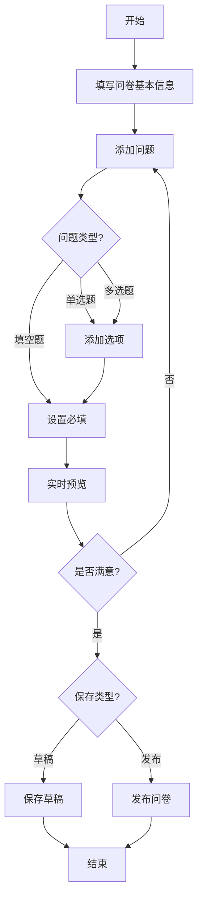
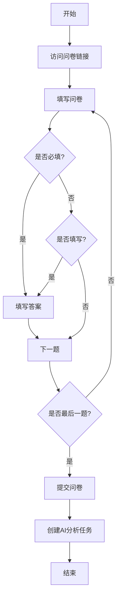
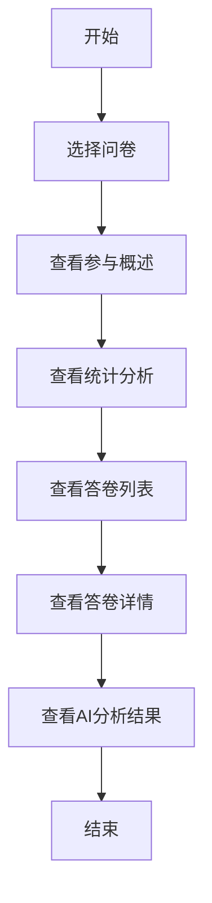
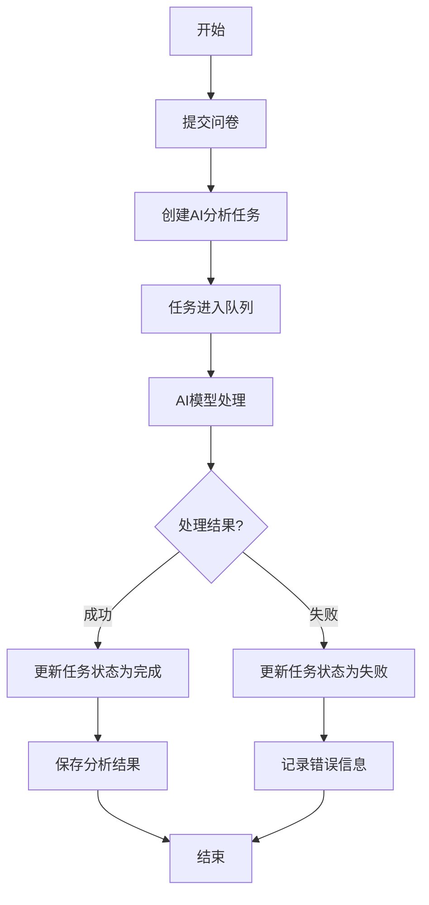
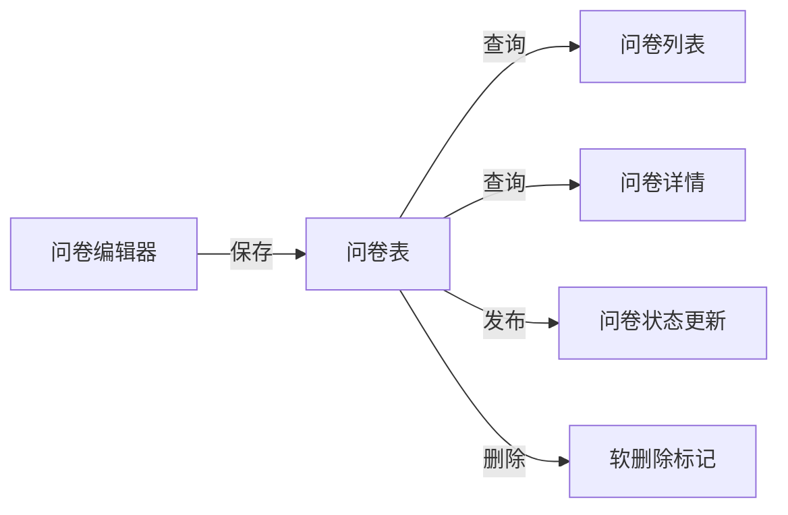
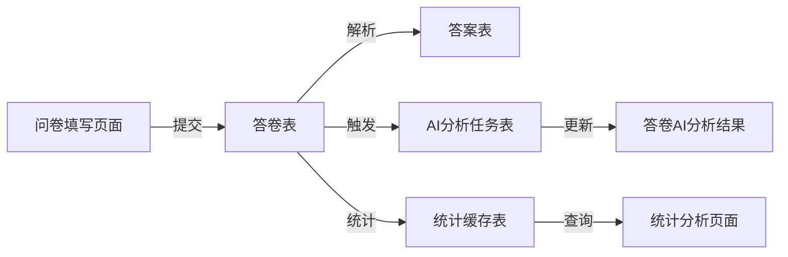
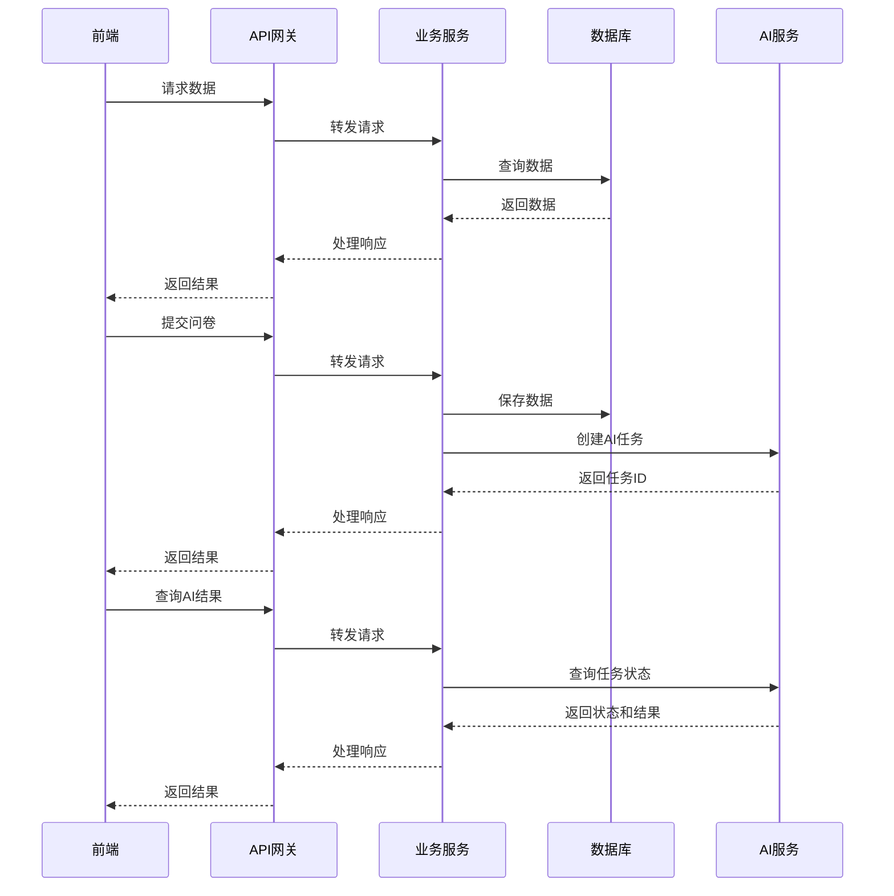
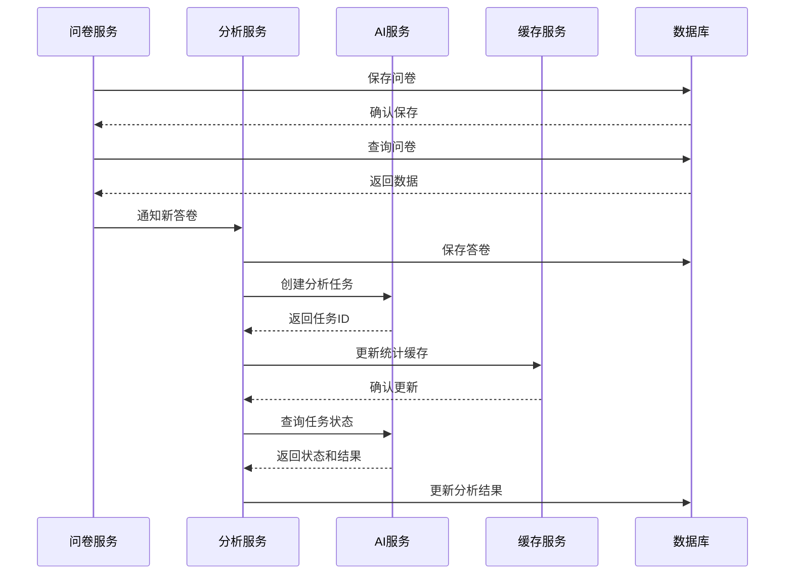
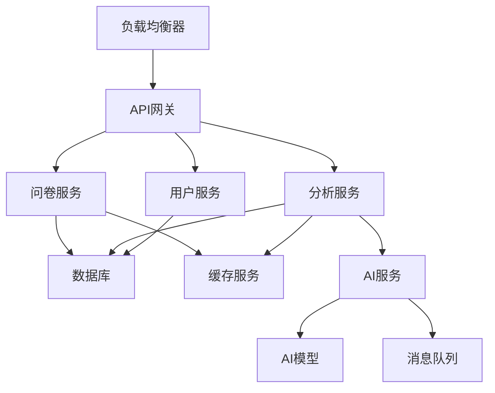

# 问卷管理系统业务逻辑设计文档

## 1. 系统需求分析

### 1.1 核心需求

基于对问卷管理系统的分析，我们识别出以下核心需求：

1. **问卷全生命周期管理**：从创建、编辑、发布到下线，支持问卷的完整生命周期管理
2. **多样化题型支持**：支持单选题、多选题、填空题等多种题型
3. **实时预览功能**：编辑问卷时能够实时预览效果
4. **数据收集与分析**：收集问卷回答数据，提供统计分析功能
5. **AI智能分析**：利用AI技术对问卷回答进行智能分析，提供用户画像、反馈要点、情感分析等

### 1.2 用户角色

系统主要面向以下用户角色：

1. **问卷管理员**：负责创建、编辑、发布和管理问卷
2. **问卷填写者**：参与问卷填写
3. **数据分析师**：查看问卷数据和分析结果
4. **系统管理员**：负责系统配置

### 1.3 功能模块

系统主要包含以下功能模块：

1. **问卷管理模块**：问卷的创建、编辑、发布、预览和填写
2. **问卷分析模块**：问卷数据的统计、可视化和AI分析
3. **用户管理模块**：
4. **系统配置模块**：系统参数和AI模型配置

## 2. 任务拆解

### 2.1 问卷管理模块任务

1. **问卷列表管理**
   - 实现问卷列表查询、筛选、排序功能
   - 支持按标题、状态、创建时间等条件筛选
   - 实现分页查询

2. **问卷创建与编辑**
   - 实现问卷基本信息设置（标题、描述、截止时间等）
   - 支持添加、编辑、删除问题
   - 支持设置问题类型、选项和必填属性
   - 实现实时预览功能

3. **问卷发布控制**
   - 实现问卷状态管理（草稿、已发布、已下线）
   - 支持问卷发布和下线操作
   - 实现问卷截止时间控制

4. **问卷填写**
   - 实现问卷填写界面
   - 支持表单验证
   - 实现答卷提交功能

### 2.2 问卷分析模块任务

1. **参与概述**
   - 实现问卷总体统计（答卷数量、答完率、平均用时）
   - 实现答卷趋势图（每日答卷数量）

2. **统计分析**
   - 实现各问题类型的统计分析
   - 支持数据可视化（饼图、柱状图等）
   - 实现数据导出功能

3. **答卷列表**
   - 实现答卷查询和筛选
   - 支持查看答卷详情
   - 实现答卷数据导出

4. **AI分析**
   - 实现答卷AI分析任务创建
   - 支持AI分析结果展示
   - 实现用户画像、反馈要点、情感分析等功能

### 2.3 用户管理模块任务

1. **用户管理**
   - 实现用户创建、编辑、删除功能
   - 实现用户登录和登出功能

2. **用户认证与授权**
   - 实现用户登录认证
   - 支持密码加密和重置
   - 实现会话管理
   - 支持单点登录
   - 实现访问令牌管理

### 2.4 系统配置模块任务

1. **系统参数配置**
   - 实现系统参数设置
   - 支持参数动态更新

2. **AI模型配置**
   - 实现AI模型参数配置
   - 支持模型选择和切换
   - 实现模型性能监控

## 3. 接口业务逻辑设计

### 3.1 问卷管理接口

#### 3.1.1 获取问卷列表

**接口路径**：`/survey/questionnaire/list`

**业务逻辑**：
1. 接收查询参数（标题、状态、创建时间范围、分页信息）
2. 根据参数构建查询条件
3. 从数据库查询符合条件的问卷记录
4. 计算总记录数
5. 返回分页数据和总记录数

**实现步骤**：
1. 参数验证和转换
2. 构建SQL查询条件
3. 执行数据库查询
4. 处理查询结果
5. 返回响应数据

#### 3.1.2 获取问卷详情

**接口路径**：`/survey/questionnaire/detail`

**业务逻辑**：
1. 接收问卷ID参数
2. 根据ID查询问卷详细信息
3. 解析问卷内容JSON数据
4. 返回问卷详情数据

**实现步骤**：
1. 参数验证
2. 查询问卷基本信息
3. 解析问卷内容JSON
4. 返回响应数据

#### 3.1.3 保存问卷

**接口路径**：`/survey/questionnaire/save`

**业务逻辑**：
1. 接收问卷数据（ID、标题、描述、内容、状态等）
2. 验证必填字段
3. 处理问卷内容JSON数据
4. 根据ID判断是新增还是更新操作
5. 保存问卷数据到数据库
6. 返回操作结果

**实现步骤**：
1. 参数验证
2. 处理问卷内容JSON
3. 判断操作类型（新增/更新）
4. 执行数据库操作
5. 返回响应数据

#### 3.1.4 删除问卷

**接口路径**：`/survey/questionnaire/remove`

**业务逻辑**：
1. 接收问卷ID参数
2. 验证问卷是否存在
3. 检查问卷状态（已发布的问卷不允许删除）
4. 执行软删除操作
5. 返回操作结果

**实现步骤**：
1. 参数验证
2. 查询问卷信息
3. 状态检查
4. 执行软删除
5. 返回响应数据

#### 3.1.5 更新问卷状态

**接口路径**：`/survey/questionnaire/updateStatus`

**业务逻辑**：
1. 接收问卷ID和状态参数
2. 验证问卷是否存在
3. 检查状态转换是否合法
4. 更新问卷状态
5. 记录状态变更日志
6. 返回操作结果

**实现步骤**：
1. 参数验证
2. 查询问卷信息
3. 状态转换验证
4. 执行状态更新
5. 记录操作日志
6. 返回响应数据

### 3.2 问卷分析接口

#### 3.2.1 获取答卷列表

**接口路径**：`/survey/analysis/responseList`

**业务逻辑**：
1. 接收查询参数（问卷ID、提交人、提交时间范围、分页信息）
2. 根据参数构建查询条件
3. 从数据库查询符合条件的答卷记录
4. 计算总记录数
5. 返回分页数据和总记录数

**实现步骤**：
1. 参数验证和转换
2. 构建SQL查询条件
3. 执行数据库查询
4. 处理查询结果
5. 返回响应数据

#### 3.2.2 获取答卷详情

**接口路径**：`/survey/analysis/responseDetail`

**业务逻辑**：
1. 接收答卷ID参数
2. 根据ID查询答卷详细信息
3. 解析答卷内容JSON数据
4. 查询AI分析结果
5. 返回答卷详情数据

**实现步骤**：
1. 参数验证
2. 查询答卷基本信息
3. 解析答卷内容JSON
4. 查询AI分析结果
5. 返回响应数据

#### 3.2.3 获取问卷统计数据

**接口路径**：`/survey/analysis/statistics`

**业务逻辑**：
1. 接收问卷ID参数
2. 查询问卷基本信息
3. 查询问卷总体统计（总答卷数、答完率、平均用时）
4. 查询各问题统计结果
5. 查询每日答卷数量统计
6. 返回统计数据

**实现步骤**：
1. 参数验证
2. 查询问卷信息
3. 查询总体统计（优先使用缓存）
4. 查询问题统计（优先使用缓存）
5. 查询每日统计（优先使用缓存）
6. 返回响应数据

#### 3.2.4 导出答卷数据

**接口路径**：`/survey/analysis/exportResponses`

**业务逻辑**：
1. 接收问卷ID参数
2. 查询问卷信息和所有答卷数据
3. 解析答卷内容JSON数据
4. 生成Excel文件
5. 返回文件下载链接

**实现步骤**：
1. 参数验证
2. 查询问卷和答卷数据
3. 解析答卷内容
4. 生成Excel文件
5. 返回文件下载链接

### 3.3 AI分析接口

#### 3.3.1 创建AI分析任务

**接口路径**：`/survey/ai/createTask`

**业务逻辑**：
1. 接收答卷ID参数
2. 验证答卷是否存在
3. 创建AI分析任务记录
4. 将任务加入处理队列
5. 返回任务ID

**实现步骤**：
1. 参数验证
2. 查询答卷信息
3. 创建任务记录
4. 加入处理队列
5. 返回响应数据

#### 3.3.2 获取AI分析结果

**接口路径**：`/survey/ai/getResult`

**业务逻辑**：
1. 接收任务ID参数
2. 查询任务状态和结果
3. 如果任务未完成，返回处理状态
4. 如果任务完成，返回分析结果
5. 如果任务失败，返回错误信息

**实现步骤**：
1. 参数验证
2. 查询任务信息
3. 根据任务状态返回相应数据
4. 返回响应数据

## 4. 业务流程设计

### 4.1 问卷创建流程

### 4.2 问卷填写流程

### 4.3 问卷分析流程

### 4.4 AI分析流程

## 5. 数据流转设计

### 5.1 问卷数据流转

### 5.2 答卷数据流转

### 5.3 AI分析数据流转

## 6. 系统交互设计

### 6.1 前后端交互

### 6.2 服务间交互

## 7. 异常处理设计

### 7.1 业务异常

| 异常类型 | 错误码 | 处理方式 | 用户提示 |
|---------|--------|---------|---------|
| 问卷不存在 | 1001 | 返回错误响应 | "问卷不存在或已被删除" |
| 问卷已下线 | 1002 | 返回错误响应 | "问卷已下线，无法填写" |
| 问卷已截止 | 1003 | 返回错误响应 | "问卷已截止，无法填写" |
| 必填项未填写 | 1004 | 返回错误响应 | "请填写必填项" |
| 无权操作 | 1005 | 返回错误响应 | "您无权执行此操作" |
| 状态转换非法 | 1006 | 返回错误响应 | "非法的状态转换" |

### 7.2 系统异常

| 异常类型 | 错误码 | 处理方式 | 用户提示 |
|---------|--------|---------|---------|
| 数据库连接失败 | 2001 | 记录日志，返回错误响应 | "系统繁忙，请稍后再试" |
| 参数验证失败 | 2002 | 返回错误响应 | "请求参数错误" |
| AI服务不可用 | 2003 | 降级处理，返回错误响应 | "AI分析服务暂时不可用" |
| 缓存服务异常 | 2004 | 降级到数据库查询 | 无提示 |
| 系统内部错误 | 2005 | 记录日志，返回错误响应 | "系统内部错误，请联系管理员" |

## 8. 性能优化设计

### 8.1 数据库优化

1. **索引优化**：
   - 为常用查询条件创建索引
   - 使用复合索引减少索引数量
   - 定期分析索引使用情况

2. **查询优化**：
   - 使用分页查询减少数据量
   - 避免全表扫描
   - 使用预编译SQL语句

3. **数据分区**：
   - 对大型表按时间分区
   - 定期归档历史数据

### 8.2 缓存优化

1. **多级缓存**：
   - 使用本地缓存存储热点数据
   - 使用分布式缓存存储共享数据
   - 使用数据库缓存存储持久化数据

2. **缓存策略**：
   - 统计数据定时更新
   - 问卷内容按需缓存
   - 设置合理的过期时间

### 8.3 AI分析优化

1. **异步处理**：
   - 答卷提交后异步创建AI分析任务
   - 使用消息队列解耦任务创建和处理
   - 支持任务重试机制

2. **批量处理**：
   - 支持批量创建AI分析任务
   - 优化AI模型调用频率
   - 实现任务优先级管理

## 9. 安全设计

### 9.1 数据安全

1. **敏感信息保护**：
   - 对用户个人信息进行加密存储
   - 匿名问卷不记录提交人信息
   - 实现数据脱敏机制

2. **数据备份**：
   - 定期备份重要数据
   - 实现数据恢复机制
   - 保留关键操作日志

### 9.2 防攻击措施

1. **输入验证**：
   - 防止SQL注入
   - 防止XSS攻击
   - 实现请求参数验证

2. **访问限制**：
   - 实现请求频率限制
   - 防止暴力破解
   - 实现IP黑名单机制

## 10. 部署架构设计

### 10.1 系统架构

### 10.2 部署方案

1. **开发环境**：
   - 单机部署
   - 本地数据库
   - 模拟AI服务

2. **测试环境**：
   - 单机部署
   - 独立数据库
   - 测试版AI服务

3. **生产环境**：
   - 集群部署
   - 主从数据库
   - 生产版AI服务
   - 负载均衡
   - 监控告警

## 11. 实施计划

### 11.1 开发阶段

1. **需求分析与设计**（2周）
   - 需求分析
   - 数据库设计
   - 接口设计
   - 业务流程设计

2. **核心功能开发**（4周）
   - 问卷管理模块
   - 问卷分析模块
   - 用户管理模块
   - 系统配置模块

3. **AI功能开发**（2周）
   - AI分析任务管理
   - AI模型集成
   - AI结果展示

4. **测试与优化**（2周）
   - 功能测试
   - 性能测试
   - 安全测试
   - 问题修复

### 11.2 部署阶段

1. **环境准备**（1周）
   - 服务器配置
   - 数据库部署
   - 缓存服务部署
   - AI服务部署

2. **系统部署**（1周）
   - 应用部署
   - 数据迁移
   - 系统配置
   - 监控配置

3. **上线与运维**（持续）
   - 系统上线
   - 性能监控
   - 问题处理
   - 定期维护

## 12. 总结

本业务逻辑设计文档详细描述了具有AI能力的问卷管理系统的需求分析、任务拆解、接口业务逻辑、业务流程、数据流转、系统交互、异常处理、性能优化、安全设计和部署架构等内容。

通过合理的设计和实施，可以构建一个高效、可靠、安全的问卷管理系统，满足用户的各种需求，并提供智能化的数据分析能力。 